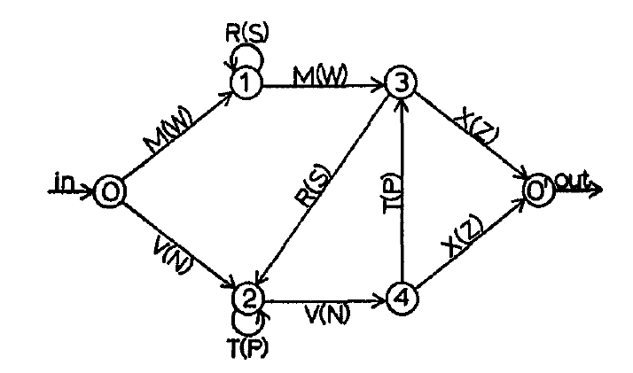
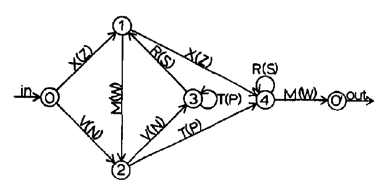
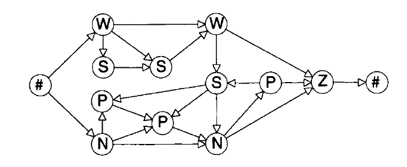
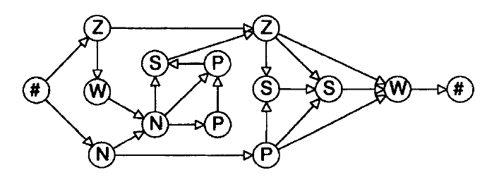

# Continual-Learning

### Artificial Grammar Learning Experiment Milne et al 2018

Familiarisation -> Test -> Refamilarisation -> Test ...

Familiarisation:
Monkey:
- 20 times each exposure sequence in random order
Human:
- 6 times each exposure sequence in random order

Test:
Monkey:
- Many trials. Many Many trials.
- Response: Analysis looking duration.
Human:
- 32 test sequences; incorrect sequence twice, correct sequence four times;
- Response: Forced choice key press.

Refamiliarisation:
Monkey:
- 8 times each exposure
Human:
- 4 times each exposure sequence

Exposure sequences:
```
['A','C','F'],
['A','C','F','C','G'],
['A','C','G','F'],
['A','C','G','F','C','G'],
['A','D','C','F'],
['A','D','C','F','C'],
['A','D','C','F','C','G'],
['A','D','C','G','F','C','G'],
```
Test sequences:
```
correct: ['A','C','F','C','G'],
correct: ['A','D','C','F','G'],
correct: ['A','C','G','F','C'],
correct: ['A','D','C','G','F'],
incorrect: ['A','D','C','F','G'],
incorrect: ['A','D','F','C','G'],
incorrect: ['A','D','G','C','F'],
incorrect: ['A','D','G','F','C'],
incorrect: ['A','G','C','F','G'],
incorrect: ['A','G','F','G','C'],
incorrect: ['A','G','D','C','F'],
incorrect: ['A','G','F','D','C'],
```
## Grammars

### Grammatical

Original from A.S. Reuber, 1969:

Grammar 1:


Grammar 2:


- Every token on average the same information
- Both Grammars exactly 43 different paths from start to finish with length <= 8


Converted from Gomez & Schwaneveldt, 1994

Grammar 1:


Grammar 2:


### (Un)grammatical sequence constraints

Vokey-Brooks-1992:
- 3 to 7 letter seqs
- different seqs at least edit distance 2
- balanced seq length, balanced usage of transitions
- ug seqs differed in only one position (edit distance 1)
- Accuracy in Recognition Task 72%

Lotz-Kinder-2006:
- same as Vokey-Brooks
- non-transfer accuracy: 56% (still significant) transfer: 54%

Gomez-Schvaneveldt-1994:
- Letter repetitions limited to two
- No ungrammaticalities at beginning or end of seq
- Ungrammaticalities: insertion of 'illegal pair' into string, insertion of 'legal pair' into wrong location
- do not use hits but sensitivity as measure..


## Adhoc

### Old Grammar

5 Stimuli: A C D G F

```
   D    G    C -> G
 /  \ /  \ /  \  /
A -> C -> F -> END
```

Based on:
```
S -> AP + CP + FP
AP -> A + (D)
CP -> C + (G)
FP -> F + (CP)
```
Predictable


Example for unpredictable (Saffran 2008):
```
S -> AP + BP
AP -> {(A) + (D)}
BP -> CP + F
CP -> {(C) + (G)}

{} == xor
```

### Grammar 3 (ad hoc)

5 Stimuli: A C D G F

Basis:
```
S -> AP + FP
AP -> A + (DP)
DP -> D + (CP)
CP -> C + (G)
FP -> F + (CP)
```

### Shifted Grammar experiment

1. Train on basis grammar
2. Reinitiate specific layers
3. Train on basis grammar again

## Model architecture

### Encoder
 Input -> Embedding -> Dropout -> fc_one -> ReLU -> dropout -> LSTM -> Hidden

### Decoder (single token decoder)
                            Hidden -> \
 PrevToken -> Embedding -> Dropout -> LSTM -> fc_one -> ReLU -> dropout -> fc_out -> Output/Hidden
## Model parameters

encoder.embed.weight
encoder.lstm.weight_ih_l0
encoder.lstm.weight_hh_l0
encoder.lstm.bias_ih_l0
encoder.lstm.bias_hh_l0
encoder.lstm.weight_ih_l0_reverse
encoder.lstm.weight_hh_l0_reverse
encoder.lstm.bias_ih_l0_reverse
encoder.lstm.bias_hh_l0_reverse
encoder.fc_one.weight
encoder.fc_one.bias
decoder.embed.weight
decoder.lstm.weight_ih_l0
decoder.lstm.weight_hh_l0
decoder.lstm.bias_ih_l0
decoder.lstm.bias_hh_l0
decoder.lstm.weight_ih_l0_reverse
decoder.lstm.weight_hh_l0_reverse
decoder.lstm.bias_ih_l0_reverse
decoder.lstm.bias_hh_l0_reverse
decoder.fc_out.weight
decoder.fc_out.bias
decoder.fc_one.weight
decoder.fc_one.bias

## Open Topic

How to measure the transfer?
Architecture redo

