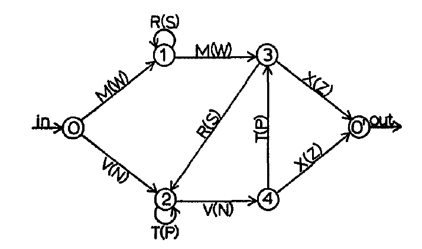
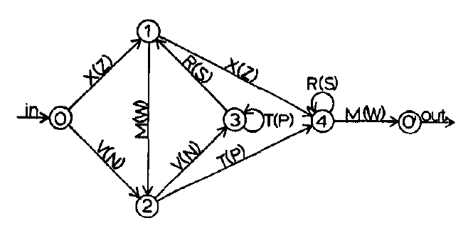
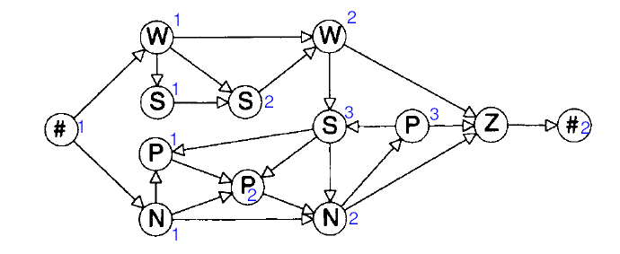
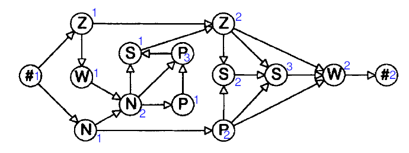

# Continual-Learning

The repository has two important parts:
1. cifar10x10.ipynb
2. agl

## cifar10x10.ipynb

The notebook contains an algorithmic basis to test continual learning algorithms.
It implements Finetune, EWC, Basic DynaMoE, (adapted DynaMoE and Ensembling to
come) and provides for a easy environment to set up a continual learning task
in the jupyter notebook for cifar10x10.

The convolutional layers are loaded from `convLayers_trained_cifar10.pt` which
are created in [pre_train_on_cifar10.ipynb](./pre_train_on_cifar10.ipynb).
They also can be used for the MNIST dataset. For pictures with higher resolutions
I recommend either downscaling or using a pre-trained resnet.

## AGL Folder

The AGL Folder aims at recreating the Milne et al AGL experiment on a computer.

It contains the [agl_latest.ipynb](./agl/agl_latest.ipynb) notebook which
implements data preparation and simulation of an AGL experiment with any
provided Grammar.

AGL is a one-class sequence learning task. Thus a Seq2Seq model is implemented.
The model is purposefully not too powerful to prevent instant generalization to
even ungrammatical sequences (which in some cases only differ by edit distance 1).
The model tries to recreate input sequences, if it recreates them correctly we
interpret that it is judging the input as "within the learned grammar".

Continual learning for the model is realized by different methods:
1. [DynaMoE](https://doi.org/10.1073/pnas.2009591117), which is adapted to the
supervised and recurrent setting. The model makes use of a mixture of experts:
multiple experts are individually trained and a gating network decides
which expert to use. The original implementation has drawbacks, the biggest one
being that after new expert initialization the old experts become untrainable.
Furthermore it makes use of some sort of "learning oracle": the model assumes
that only the same task is fed to it until convergence.
2. AdaMoE, an adapted version of the previous DynaMoE model. It automatically
assign its incoming training examples to the different experts depending on
the classification error. Furthermore, original task data is replayed to the
gating network to prevent the gating from catastrophically forgetting which
experts to assign inputs to.
3. The Ensembler. Instead of choosing an expert, the ensembler multiplies
the experts outputs and adds them. Thus, intermediate outputs between experts
outputs are possible. The model has an essential flaw: due to self-reinforcing
effects when training with backprop the model always converges to one expert
doing all the heavy lifting with all other models having little to none
influence on the outputs.
4. The Ansembler, an adapted version of the Ensembler.
The Ensembler is improved by a replay mechanism and a training mechanism
which does not backpropagate the error entirely through the gating, but
choses a specific expert to be trained based on the classification error.
This prevents the expert overpreference problem from above.

### AGL Model architecture

#### Encoder
```
Input -> Embedding -> Dropout -> fc_one -> ReLU -> dropout -> LSTM -> Hidden
```
#### Decoder (single token decoder)
```
                            Hidden -> \
PrevToken -> Embedding -> Dropout -> LSTM -> fc_one -> ReLU -> dropout -> fc_out -> Output/Hidden
```
### Artificial Grammar Learning Experiment Milne et al 2018

Familiarisation -> Test -> Refamilarisation -> Test ...

Familiarisation:
Monkey:
- 20 times each exposure sequence in random order
Human:
- 6 times each exposure sequence in random order

Test:
Monkey:
- Response: Analysis of looking duration.
Human:
- 32 test sequences; incorrect sequence twice, correct sequence four times;
- Response: Forced choice key press.

Refamiliarisation:
Monkey:
- 8 times each exposure
Human:
- 4 times each exposure sequence

Exposure sequences:
```
['A','C','F'],
['A','C','F','C','G'],
['A','C','G','F'],
['A','C','G','F','C','G'],
['A','D','C','F'],
['A','D','C','F','C'],
['A','D','C','F','C','G'],
['A','D','C','G','F','C','G'],
```
Test sequences:
```
correct: ['A','C','F','C','G'],
correct: ['A','D','C','F','G'],
correct: ['A','C','G','F','C'],
correct: ['A','D','C','G','F'],
incorrect: ['A','D','C','F','G'],
incorrect: ['A','D','F','C','G'],
incorrect: ['A','D','G','C','F'],
incorrect: ['A','D','G','F','C'],
incorrect: ['A','G','C','F','G'],
incorrect: ['A','G','F','G','C'],
incorrect: ['A','G','D','C','F'],
incorrect: ['A','G','F','D','C'],
```
### Grammars

Following section contains visualizations of the used grammar and
alternate grammars. Although the notebook is equipped to handle
all following grammars the original Milne Grammar is used.

#### Milne Grammar

5 Stimuli: A C D G F

```
   D    G    C -> G
 /  \ /  \ /  \  /
A -> C -> F -> END
```

Based on:
```
S -> AP + CP + FP
AP -> A + (D)
CP -> C + (G)
FP -> F + (CP)
```
"Predictable"


Example for "unpredictable" (Saffran 2008):
```
S -> AP + BP
AP -> {(A) + (D)}
BP -> CP + F
CP -> {(C) + (G)}

{} == xor
```


#### Adhoc alternate Grammar
Grammar 3

5 Stimuli: A C D G F

Basis:
```
S -> AP + FP
AP -> A + (DP)
DP -> D + (CP)
CP -> C + (G)
FP -> F + (CP)
```

#### Original from A.S. Reuber, 1969:

Grammar 1:


Grammar 2:


- Every token on average the same information
- Both Grammars exactly 43 different paths from start to finish
with length <= 8


Converted from Gomez & Schwaneveldt, 1994

Grammar 1:


Grammar 2:


#### Ungrammatical sequence constraints
To create ungrammatical sequences different people use
different constraints. Here is a little selection of some:

Vokey-Brooks-1992:
- 3 to 7 letter seqs
- different seqs at least edit distance 2
- balanced seq length, balanced usage of transitions
- ug seqs differed in only one position (edit distance 1)
- Accuracy in Recognition Task 72%

Lotz-Kinder-2006:
- same as Vokey-Brooks
- non-transfer accuracy: 56% (still significant) transfer: 54%

Gomez-Schvaneveldt-1994:
- Letter repetitions limited to two
- No ungrammaticalities at beginning or end of seq
- Ungrammaticalities: insertion of 'illegal pair' into string, insertion
of 'legal pair' into wrong location
- do not use hits but sensitivity as measure..

